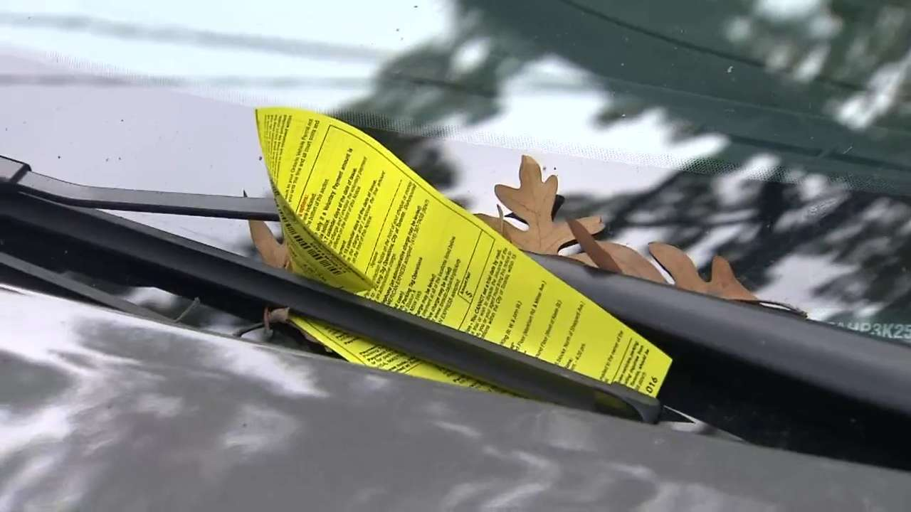

     --A study regarding to parking tickets in NYC during 2020.

Zhuohui Liang, Chufeng Yang, Yiming Zhao, Yu Liu

##Motivation

You temporarily parked in front of your office building to buy a cup of coffee in a side-walk cafe. A parking ticket warrior walked to your car, raised her scanner, and fired an invisible beam of light at your registration. She handed you a NYC parking ticket and that beam of light cost you $115.

 According to statistics, New Yorkers drink 6.7 times the amount of coffee compared to average, and the average price consumers are paying for a cup of coffee is $2.99, but consider the above, do you think you really only paid a few bucks on your coffee?
 
 
##Reaserch questions

##Main results