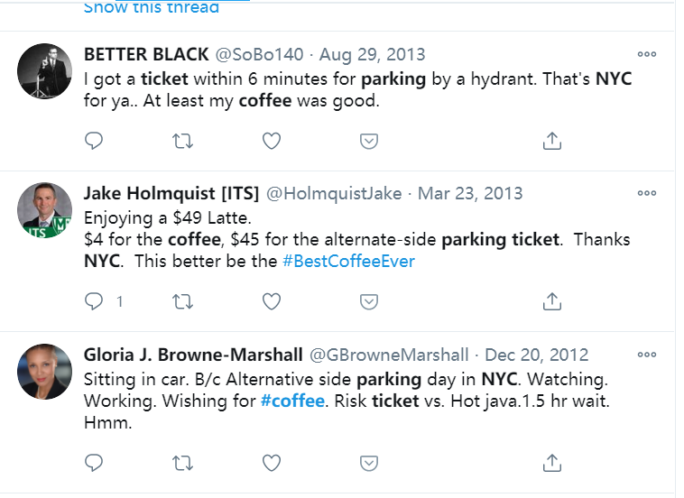
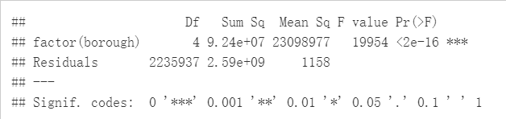
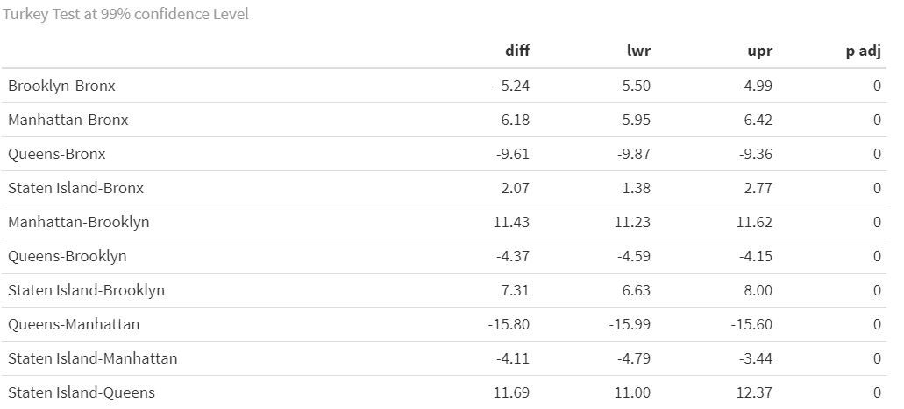
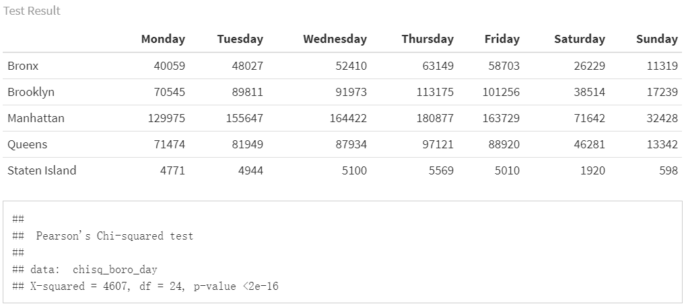
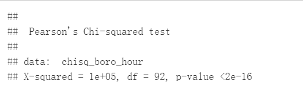

```{r setup, include=FALSE}
knitr::opts_chunk$set(echo = TRUE)
library(tidyverse)
library(readxl)
library(patchwork)
library(plotly)
library(leaflet)
library(ggplot2)
library(lubridate)

knitr::opts_chunk$set(
  fig.height = 6,
  fig.width = 8,
  message = F,
  echo = T,
  warning = F,
  cache = F
)
theme_set(theme_minimal() + theme(legend.position = "bottom"))
options(
  ggplot2.continuous.colour = "viridis",
  ggplot2.continuous.fill = "viridis",
  digits = 3
)

scale_colour_discrete = scale_colour_viridis_d
scale_fill_discrete = scale_fill_viridis_d
```


## Motivation

\ If you live in NYC, you might encounter this awkward situation someday:   

\ You temporarily parked in front of your office building to buy a cup of coffee in a side-walk cafe. A parking ticket warrior walked to your car, raised her scanner, and fired an invisible beam of light at your registration. She handed you a NYC parking ticket and that beam of light cost you $115.

\ According to statistics, New Yorkers drink 6.7 times the amount of coffee compared to average, and the average price consumers are paying for a cup of coffee is $2.99, but consider the above, we might have pay way more than few bucks for the coffee.

\ This is also hot topic on twitter   

 


<b>related work</b>


The following resources are a sample of what inspired this project:

\ 1.The Real Cost of Parking Tickets: 16 U.S. Cities Make Over $1.4 Billion in Annual Parking Ticket Revenue. [link](https://www.carrentals.com/blog/parking-tickets-cost-americans/)

\ 2.Red Zone, Blue Zone: Discovering Parking Ticket Trends in New York City.
[link](https://newyorkparkingticket.com/wp-content/uploads/2016/11/NYC-Parking-Ticket-Report_parking_Samuel_Ackerman5.pdf)


## Questions

\ At very first, we wanted to focus on the parking tickets rate and coffee shops, with the assumption that in the locations where registered coffee shops are nearby, the overall parking tickets would be more than other locations. Also, the total fine amount of parking tickets would be significant in these areas. After deep dive into the dataset, our questions extended more to the characteristics of the parking tickets issued in 2021.


\ 1. Is there any relationship between coffee shop and parking tickets rate?

\ 2. Was the total parking tickets fine amount within 100 meters of coffee shops higher?

\ 3. How have the distribution of parking tickets rate vary across the year of 2021? And was there any pattern for the tickets rate to change within one day and one week?

\ 4. How was the geographic distribution of parking tickets in NYC? Are the tickets rate change with the same pattern in all the five boroughs?

\ 5. What are the most commonly issured parking tickets type? Are they being different in different boroughs?

Our question might shifted a bit during the exploration and regression, due to either falling into a rabbit hole or the data limitation( or our limitation).

## Data

### Data Sorce

All data was downloaded from [NYC Open Data](https://opendata.cityofnewyork.us/).  

* For parking violation information: [Parking Violations Issued - Fiscal Year 2021](https://data.cityofnewyork.us/City-Government/Parking-Violations-Issued-Fiscal-Year-2021/pvqr-7yc4)

This dataset contains 380 million violations issued during the 2021 fiscal year.Data is provided by the Department of Finance (DOF).Each record represents a single violation issued. Information on summond number, issue date, violation code and issue street, house number,ect. are recorded. The Issuance datasets are not updated to reflect violation status, the information only represents the violation(s) at the time they are issued.

A ParkingViolation Code excel is attached to this dataset, which records corresponding violation information of each violation code.

* For café in NYC: [Sidewalk Café Licenses and Applications](https://data.cityofnewyork.us/Business/Sidewalk-Caf-Licenses-and-Applications/qcdj-rwhu)

This dataset features detailed information about sidewalk café license applications and, if applicable, issued licenses. Data is provided by the Department of Consumer Affairs (DCA). There are total of 1124 cafe information,each record represents a single sidewalk café. Location information, such as street number and house humber are recorded.


### Data Processing and Cleaning

\ We set NYC Open Data as primary data source, and required:

1. Parking Violations Issued - Fiscal Year 2021
1. Sidewalk Café Licenses and Applications


\ First we focus on acquiring our own geographic information via available information in the datasets. 

\ We wrote a function to pull geographic information 
from [Geosearch](https://labs-geosearch-docs.netlify.app/). We got longitude and latitude information
of each violation through that function and will write them in our resulting dataset. 

\ This function works for the most of the observation, but we have encounter some bug during querying. Because this is a experimental platform(Alpha?), so 
There's some mismatch due to the query input and the dictionary and fuzzy matching on their site(eg. "N,E 26th ST" may not find a perfect match on that website, and it returned a closest match back, but it wasn't the location for the query). We try to cross validation with other platforms(eg. Google Maps and OpenStreet), but all those platforms charge and have limit amount of query far smaller than our query. So we ploted the location of all query onto the map, it looks like NYC and random check some points and they all fit, so we stick to our function.


```{r eval=FALSE}
###select variables we need
data_2021 =
  read_csv("./data/Parking_Violations_Issued_-_Fiscal_Year_2021.csv") %>%
  janitor::clean_names() %>%
  mutate(
    borough =
      case_when(
        violation_county %in% c("BK", "K") ~ "Brooklyn",
        violation_county %in% c("MN", "NY") ~ "Manhattan",
        violation_county %in% c("Q", "QN") ~ "Queens",
        violation_county %in% c("BX") ~ "Bronx"
      ),
    borough = replace_na(borough, "Staten Island")
  ) %>% 
  select(
    summons_number,
    issue_date,
    house_number,
    street_name,
    intersecting_street,
    violation_time,
    violation_code
    violation_code,
    borough
  )

###pull out house number(without NA) +street number
park21house_geo_df =
  data_2021 %>%
  subset(select = c(house_number, street_name)) %>%
  drop_na(house_number) %>%
  unite("address",
        house_number:street_name,
        sep = ",",
        remove = FALSE) %>%
  distinct(address, .keep_all = TRUE) %>%
  rowid_to_column("id")

###pull out street number +intersect street(without NA)
park21sec_geo_df =
  data_2021 %>%
  subset(select = c(house_number, street_name, intersecting_street)) %>%
  mutate(house_number = replace_na(house_number, "0")) %>%
  filter(house_number == "0") %>%
  drop_na(intersecting_street) %>%
  unite("address",
        street_name:intersecting_street,
        sep = ",",
        remove = FALSE) %>%
  distinct(address, .keep_all = TRUE) %>%
  rowid_to_column("id") %>%
  select(-house_number)

get_location =
  function(location_name = "Columbia University",
           .pd = NA) {
    if (!is.na(.pd)) {
      .pd$tick()$print()
    }
    
    location_name = str_c(
      "https://geosearch.planninglabs.nyc/v1/search?text=",
      location_name,
      ", New York, NY&size=2"
    )
    
    url =
      URLencode(location_name)
    
    df = read_sf(GET(url) %>% content("text"))
    
    if (nrow(df) == 0) {
      return(tibble(
        long = NA,
        lat = NA,
        borough = NA
      ))
    }
    
    geometry = df %>%
      pull(geometry) %>%
      as.tibble() %>%
      mutate(geometry = as.character(geometry),
             geometry = str_replace_all(geometry, "c|[\\(\\)]", "")) %>%
      separate(geometry, into = c("long", "lat"), sep = ",") %>%
      mutate_all(as.numeric) %>%
      summarise(long = mean(long),
                lat = mean(lat)) %>%
      mutate(borough =
               df %>%
               slice(1)
             %>% pull(borough))
    
    return(geometry)
  }

if (!file.exists("data/house_no_dic.csv")){
  
  if (nrow("data/cache.csv")==0){
    write_csv(tibble(id = NA),"data/cache.csv")
  }
  
  while (T) {
    output = list()
    doit = function(output, i) {
      cat(i, "\n")
      pb = progress_estimated(length((1 + 500 * (i - 1)):500 * i))
      output[[i]] = park21house_geo_df %>%
        #arrange(desc(id)) %>%
        slice((1 + 500 * (i - 1)):500 * i) %>%
        mutate(geo = map(.x = address,  ~ get_location(.x, pb))) %>%
        unnest(geo)
      return(output[[i]])
    }
    for (i in 1:nrow(park21house_geo_df) %/% 500 + 1) {
      park21house_geo_df =
        park21house_geo_df %>%
        filter(!id %in% pull(read_csv(here::here(
          "data/cache.csv"
        )), id))
      
      if (length(output) >= i) {
        if (!is.null(output[[i]])) {
          next
        }
      }
      output[[i]] = tryCatch(
        doit(output, i),
        error = function(cond)
          return(NULL),
        T
      )
      output %>%
        bind_rows() %>%
        bind_rows(read_csv(here::here("data/cache.csv"))) %>%
        select(id:borough) %>%
        write_csv(here::here("data/cache.csv"))
      output = list()
    }
    if (i == nrow(park21house_geo_df) %/% 500 + 1) {
      park21house_geo_df = bind_rows(output)
      break
    }
  }
  
  
  st =
    read_csv(here::here("data/Centerline.csv")) %>%
    janitor::clean_names() %>%
    select(street_name = full_stree, geom = the_geom) %>%
    mutate(
      geom = str_extract_all(geom, "\\-.+,"),
      geom = str_split(geom, ",\\s?"),
      geom = map(geom, vec_to_df)
    ) %>%
    unnest(geom) %>%
    separate(geo, into = c("long", "lat"), sep = " ") %>%
    drop_na() %>%
    mutate(across(c(long, lat), as.numeric))
  
  street_intersect =
    function(street_1, street_2, .pd = NULL) {
      if (!is.na(.pd)) {
        .pd$tick()$print()
      }
      
      street_1_df =
        st %>%
        filter(
          street_name ==
            agrep(
              street_1,
              st %>% pull(street_name),
              value = T,
              max = list(del = 0.4),
              ignore.case = T
            ) %>% first()
        ) %>%
        select(x = long, y = lat)
      
      street_2_df =
        st %>%
        filter(
          street_name ==
            agrep(
              street_2,
              st %>% pull(street_name),
              value = T,
              max = list(del = 0.4),
              ignore.case = T
            ) %>% first()
        ) %>%
        select(x = long, y = lat)
      answer = tryCatch(
        curve_intersect(street_1_df, street_2_df) %>% bind_rows(),
        error = function(cond)
          return(tibble(x = NA, y = NA)),
        T
      )
      return(answer)
    }
  
  pb = progress_estimated(nrow(park21sec_geo_df))
  park21sec_geo_df =
    park21sec_geo_df %>%
    mutate(geo = map2(.x = street_name,
                      .y = intersecting_street,
                      ~ street_intersect(.x, .y, pb))) %>%
    unnest(geo) %>%
    rename(long = x, lat = y)
}
```


\ For the cafe data, we generate geographic information according to zip code, the following code was used to create the resulting dataset:

```{r eval=FALSE}
cafe =
  paging("https://data.cityofnewyork.us/resource/qcdj-rwhu.csv") %>%
  left_join(read_csv(here::here("data/zipcode.csv"))) %>%
  rename(long = longitude,
         lat = latitude,
         street_name = street)

cafe =
  cafe %>%
  filter(business_name != "MULBERRY STREET BAR LLC") %>%
  rbind(
    cafe %>%
      filter(business_name == "MULBERRY STREET BAR LLC") %>%
      select(-long,-lat,-borough) %>%
      unite("search_query", building, street_name, remove = F) %>%
      mutate(geo = map(search_query, get_location)) %>%
      unnest(geo) %>%
      select(-search_query)
  )

cafe %>%
  write_csv(here::here("data", "Sidewalk_Caf__Licenses_and_Applications_clean.csv"))
```

\ Then, clean the parking_violation issued-fiscal_year_2021 data, and add geographic information to it.

```{r eval=FALSE}
house_no_dic =
  read_csv("./data/house_no_dic.csv") %>%
  subset(select = -c(id, geo)) %>% 
  mutate(borough =
           if_else(between(lat,40.75,40.78)& borough == "Bronx",
                   "Manhattan",borough),
         borough =
           if_else(lat < 40.75 & borough == "Bronx",
                   "Brooklyn",borough))


data_2021_cleanv1 =
  read_csv("./data/Parking_Violations_Issued_-_Fiscal_Year_2021.csv") %>%
  janitor::clean_names() %>%
  rowid_to_column("id") %>%
  subset(
    select = c(
      id,
      summons_number,
      registration_state,
      issue_date,
      violation_code,
      vehicle_make,
      violation_time,
      violation_county,
      house_number,
      street_name,
      intersecting_street,
      vehicle_color,
      vehicle_year
    )
  ) %>%
  left_join(house_no_dic, by = c("house_number", "street_name")) %>% 
  separate(violation_time,
           into = c('hour', 'min', 'am_pm'),
           sep = c(2, 4)) %>%
  mutate(
    am_pm = recode(am_pm, `P` = 12, `A` = 0),
    hour = as.numeric(hour),
    hour = ifelse((hour == 12 &
                     am_pm == 12), hour, (hour + am_pm)),
    issue_date = as.Date(issue_date, tryFormats = "%m/%d/%Y")
  ) %>%
  subset(select = c(-am_pm)) %>%
  unite("time", hour:min, remove = F, sep = ":") %>%
  unite("issue_date",
        c(issue_date, time),
        remove = T,
        sep = "T") %>%
  mutate(issue_date = lubridate::ymd_hm(issue_date)) %>% 
  mutate(
    borough =
      case_when(
        violation_county %in% c("BK", "K") ~ "Brooklyn",
        violation_county %in% c("MN", "NY") ~ "Manhattan",
        violation_county %in% c("Q", "QN") ~ "Queens",
        violation_county %in% c("BX") ~ "Bronx"
      ),
    borough = replace_na(borough, "Staten Island")
  )

st_sample = #get ready for resample
  function(st_name, n = 1) {
    cat("\r", st_name)
    a = data_2021_cleanv1 %>%
      filter(!is.na(long), street_name == st_name)
    if (nrow(a) > 0) {
      a %>% 
      select(long, lat, borough) %>%
        sample_n(size = n, replace = TRUE) %>%
        return()
    } else{
      data_2021_cleanv1 %>%
        filter(!is.na(long),!is.na(address)) %>%
        select(long, lat, borough) %>%
        sample_n(size = n, replace = TRUE) %>%
        return()
    }
  }

set.seed(1) # resample for intersection
dic = data_2021_cleanv1 %>%
  filter(!is.na(street_name), is.na(long)) %>%
  select(summons_number, street_name) %>%
  nest(summons_number) %>%
  mutate(n = map(data, nrow),
         geo =
           map2(.x = street_name, .y = n, ~ st_sample(st_name = .x, n = .y))) %>% 
  unnest(c(data,geo)) %>% 
  select(-n) %>% 
  distinct(summons_number,.keep_all = T)

data_2021_cleanv1 =
  data_2021_cleanv1 %>% #putting sample data into the main data
  left_join(dic, by = "summons_number", suffix = c("", "_d")) %>%
  mutate(
    long = if_else(is.na(long), long_d, long),
    lat = if_else(is.na(lat), lat_d, lat),
    borough = if_else(is.na(borough), borough_d, borough),
    hour = if_else(hour<=24,as.integer(hour),NA)
  ) %>%
  select(id:borough)
```

\ Finally, we generate the fine_amount variable based on geographic variables and violation code. Since the fine amount is different in 
Manhattan 96th St. & below, we select them by 96th St. geographic variables, and acquire fine amount acording to the attached ParkingViolation Code excel.

\ It is interesting to notice that below 96th  St. have different fine amount for some case, so we need to identify them. NYC's streets are not horizontally or vertically distributed, so we can't just find a latitude and conclude that below them are all below 96th St. And our query function can only return point, not a line for 96th Street.

\ Instead, we looked through a bunch of open source data, and found this [Nyc-geo-metadata](https://github.com/CityOfNewYork/nyc-geo-metadata) repo have street shapefile. So we downloaded it and extract the geometry of 96th St. Then we fit a linear model to these latitude and longitude, so we have a line, then we predict the longtitude given the latitude, if the longtitude is below the predicted value and it is located in Manhattan, we identified it as below 96th Street.

```{r eval=FALSE}
st_96 = lm(lat~long,read_csv("data/96th.csv"))

fine_data = read_excel("data/ParkingViolationCodes_January2020.xlsx") %>%
  janitor::clean_names() %>%
  select(-violation_description) %>% 
  pivot_longer(
    manhattan_96th_st_below_fine_amount:all_other_areas_fine_amount,
    names_to = "below_96",
    values_to = "fine_amount"
  ) %>% 
  mutate(below_96_m = 
           case_when(below_96 == "manhattan_96th_st_below_fine_amount" ~T,
                     below_96 != "manhattan_96th_st_below_fine_amount" ~F)) %>% 
  select(-below_96)

data_2021_cleanv1 = data_2021_cleanv1 %>%
  mutate(below_96 =
           lat < predict(st_96,
                         tibble(long = data_2021_cleanv1$long)),
         below_96_m = ifelse(borough == "Manhattan" & below_96 == TRUE, T, F)
         ) %>% 
  left_join(fine_data, by = c("violation_code","below_96_m")) %>% 
  select(-below_96, -below_96_m) 
```


\ Thus, for now, we could get all our required information without acquiring a excessively large dataset(around 14 GB).

\ Also worth mentioning, during building our shiny apps, and regression model, we need to identify all points that are located within a area of certain range. Then we have 2 problems, 

first , how to define this range on longitude and latitude? 

To map a 2D area in meter to a spherical surface(Yes, the earth is spherical) in radius, we introduced another function calculated the range of radius in longitude and latitude, adjusting the location of latitude to longitude, the function is as follow:

```{r eval = F}
get_nearby_area =
  function(p_long = 0, p_lat = 0,area=100) {
    return(
      tibble(
        long_lwr = p_long - area / (6378137 * cos(pi * p_lat / 180)) * 180 / pi,
        long_upr = p_long + area / (6378137 * cos(pi * p_lat / 180)) * 180 /
          pi,
        lat_lwr = p_lat - area / 6378137 * 180 / pi,
        lat_upr = p_lat + area / 6378137 * 180 / pi
      )
    )
  }
```

Solving the first question, we have the next.

We are nesting the data into another data, and if we looked at 1000 location, and let say each of them have 3000 ticket total, we will end up with a data of 
 dim(1000,its columns)$\times$ dim(3000,its columns), a very, very large dataset for Shiny to hold. To solve this problem ,we discussed and conclude that only parking within 100 meter makes sense, because normally no one parks 500 meter away and walk to the cafe shop. We only care about stop, grab and go, so we refine our data in that range and solve this problem.

### Data description

As we discussed above, our analysis is mainly based on two files, `Sidewalk_Caf__Licenses_and_Applications_clean` and `parking_vio2021_cleanv1` 

##### Violation data

The resulting data file of `parking_vio2021_cleanv1` contains a single dataframe df with 2236062 rows of data on 48 variables, the list below is our variables of interest:

  * `summons_number`. Unique identifier of summons.
  * `issue_date`. Issue date
  * `violation_code`. Type of violation.
  * `vehicle_make`. Make of car written on summons.
  * `hour`. Time(hour) violation occurred.
  * `violation_county`. County of violation.
  * `house_number`. Address number of violation.
  * `street_name`. Street name of summons issued.
  * `intersecting_street`. Violation near intersecting street.
  * `vehicle_color`. Color of car written on summons.
  * `vehicle_year`. Year of car written on summons.
  * `long`. Longitude violation occurred.
  * `lat`. Latitude violation occurred.
  * `borough`. Borough of violation.
  * `fine_amount`. Fine amount.
  
##### Cafe data

  The resulting data file of `Sidewalk_Caf__Licenses_and_Applications_clean` contains a single dataframe df with 1156 rows of data on 19 variables, the list below is our variables of interest:

  * `business_name`. The legal business name as filed with the New York State Secretary of State or County Clerk
  * `business_name2`. If applicable, the Doing-Business-As (DBA)/trade name.
  * `lat`. Latitude of cafe.
  * `long`. Longitude of cafe.
```{r}
cafe = read_csv(here::here("data/Sidewalk_Caf__Licenses_and_Applications_clean.csv"))

```


## Exploratory Analysis

\ In this part, we explore the basic patterns and characteristics of parking tickets rates and types among different time periods and boroughs. Then we connect the location of coffee shops and parking tickets to see the potential linkage between coffee shop and parking violations.

\ First, To get the most comprehesive understanding of the distribution of violation tickets among NYC, we mapped all violation to a 3D surface.

```{r map,cache=T,echo=F}
parking = read_csv(here::here("data/parking_vio2021_cleanv1.csv")) %>%
  filter(hour != 12.3, hour <= 24) %>%
  left_join(
    read_csv("./data/Parking_Violations_Issued_-_Fiscal_Year_2021.csv") %>%
      janitor::clean_names() %>%
      select(summons_number, violation_county)
  ) %>%
  mutate(
    borough =
      case_when(
        violation_county %in% c("BK", "K") ~ "Brooklyn",
        violation_county %in% c("MN", "NY") ~ "Manhattan",
        violation_county %in% c("Q", "QN") ~ "Queens",
        violation_county %in% c("BX") ~ "Bronx"
      ),
    borough = replace_na(borough, "Staten Island")
  ) %>% 
  drop_na(address) %>% 
  filter(issue_date <= as.Date("2020-11-16"))

read_csv(here::here("data/parking_vio2021_cleanv1.csv")) %>%
  drop_na(address) %>% 
  filter(hour != 12.3) %>%
  select(long, lat, hour) %>%
  mutate(long = abs(long)) %>%
  drop_na() %>%
  with(., MASS::kde2d(lat, long)) %>%
  as_tibble() %>%
  plot_ly() %>%
  add_surface(x = ~ x, y = ~ y, z = ~ z) %>%
  layout(scene = list(
    yaixs = list(autorange = "reversed"),
    zaxis = list(
      range = c(0.1, 150),
      title = "",
      showline = FALSE,
      showticklabels = FALSE,
      showline = FALSE,
      showgrid = FALSE
    ),
    camera = list(eye = list(
      x = -1.25, y = 1.25, z = 1.25
    )),
    showlegend = FALSE
  ))

parking %>% 
  drop_na(borough) %>% 
  group_by(borough) %>% 
  summarise(ticket =
              n()/nrow(parking)) %>% 
  arrange(desc(ticket)) %>% 
  pivot_wider(
    names_from = borough,
    values_from = ticket
  ) %>% 
  knitr::kable()
```

\ Then, we made plots of tickets rate across time periods, tickets types in boroughs, and fine amount

### Parking Tickets Rate vs Time

\ To explore the pattern of parking tickets rate change over different time unit, and study the differences between boroughs, we made five plots.

  * A bar plot shows the total parking tickets during each month in each brorough
```{r bar_by_month}

parking %>% 
  mutate(month = lubridate::month(issue_date),
         month = forcats::fct_reorder(as.factor(month),month)
         ) %>% 
  drop_na(month,borough) %>% 
  group_by(borough,month) %>% 
  summarize(tickets = n()) %>% 
  ungroup() %>%
  mutate(borough = forcats::fct_reorder(borough,tickets,sum)) %>% 
  ggplot(aes(x = month, y = tickets, fill = borough,group = borough)) + 
    geom_bar(stat = "identity",position = "dodge") +
    labs(
      x = 'Issuing Month',
      y = 'counts',
      title = 'The distribution of tickets quantities over month ')
```
  * A shiny plot shows the change of parking tickets rate during a day(with respect to five boroughs, respectively)

```{r hour_map,cache=T}
nyc =
  parking %>%
  drop_na(long, lat) %>%
  summarise(
    lon_max = max(long),
    lon_min = min(long),
    lat_max = max(lat),
    lat_min = min(lat)
  )
nyc =
  ggmap::get_map(location = c(
    right = pull(nyc, lon_max),
    left = pull(nyc, lon_min),
    top = pull(nyc, lat_max),
    bottom = pull(nyc, lat_min)
  ))
set.seed(100)
read_csv(here::here("data/parking_vio2021_cleanv1.csv")) %>%
  drop_na(address) %>% 
  filter(hour != 12.3) %>%
  filter(hour <= 24) %>%
  drop_na(borough,lat,long,hour) %>% 
  sample_n(1e+5) %>% 
  mutate(text_label = str_c("borough:", borough, ",address:", address)) %>% 
  plot_ly()  %>% 
    add_markers(
    y = ~ lat,
    x = ~ long,
    text = ~ text_label,
    alpha = 0.02,
    frame = ~ hour,
    mode = "marker",
    color = ~borough,
    colors = viridis::viridis(4,option = "C")
  ) %>%
  layout(
    images = list(
      source = raster2uri(nyc),
      xref = "x",
      yref = "y",
      y = 40.5,
      x = -74.28	,
      sizey = 0.4,
      sizex = 0.58,
      sizing = "stretch",
      xanchor = "left",
      yanchor = "bottom",
      opacity = 0.4,
      layer = "below"
    )
  )%>%
  animation_opts(transition = 0,frame = 24)
```
  * A line plot shows the pattern of tickets rate change during one day for each borough.
  
```{r hour_borough}
parking %>% 
  group_by(hour,borough) %>%
  drop_na(hour,borough) %>% 
  summarise(n = n()) %>% 
  plot_ly(x = ~hour, y = ~n, type = 'scatter',mode = 'line', color= ~ borough) %>%
  layout(
    title = 'Violations per Hour',
    xaxis = list(
      type = 'category',
      title = 'Hour',
      range = c(0, 23)),
    yaxis = list(
      title = 'Count of violations'))
```
  
  * A line plot shows the pattern of tickets rate change during one week for each borough

```{r}
parking_day = parking %>%
  select(issue_date, summons_number, borough) %>% 
  drop_na(borough)

day_order = c("Monday", "Tuesday", "Wednesday", "Thursday", "Friday", "Saturday", "Sunday")

parking_day %>% 
  mutate(day_week = weekdays(issue_date)) %>%
  group_by(day_week, borough) %>% 
  summarize(n = n()) %>%
  mutate(day_week = factor(day_week, levels = day_order)) %>% 
  arrange(day_week) %>% 
  plot_ly(x = ~ day_week, y = ~ n, type = 'scatter', mode = "line", color = ~borough) %>%
  layout(
    title = 'Violations by weekday',
    xaxis = list(
      type = 'category',
      title = 'Weekday'),
    yaxis = list(
      title = 'Count of violations'))
```


\ Most of the issued ticket of 2020 by the latest data recording is centered at the 3rd quater, this very strange pattern in the normal time wouldn’t come to a surprise at 2020, as NYC didn’t reopen until late May. Once it reopened, the violation issued increased exponentially. Then the tickets issue started to fall in Sep.

\  Trend of violation tickets issued during a day can be seen via the animation below. Violation tickets mostly issued in the daytime. Two peaks are observed in the animation, which is 8 am and 13pm, representing 12.319% and 10.754% tickets issued of the day.

\  Group by borough, we seen that these trends vary. As in Manhattan, the peaks is similar to the global trend, but other boroughs have a earlier or no second peak. This might reflect the nature of most business center is located in Manhattan, and thus has a larger lunch break group.

\ The most obvious pattern in a week is that there are more tickets generated during work days than during weekends . This could be attibuted to two reasons:

 1. the overall demand for parking in NYC are smaller during weekend than during weekdays

 2. Many parking spots are designed to be free parking during weekends.

All the five boroughs in NYC–Manhattan, Bronx, Brooklyn, Queens and Staten Island have the same trend in the term of parking tickets generating across a week. Manhattan always has the highest parking tickets volume, and follows with Brooklyn, Queens, Bronx and Staten Island


### Parking Ticktes Types in Boroughs

\ We want to know the most common reason for getting tickets in NYC, and whether there are differences between the five boroughs.We made bar plots of the top 10 most frequent parking tickets type in each boroughs.

\ Violation types in each borough also have different compositions. No 
standing-day/time limit most common type of violation in Manhattan,
followed by no parking-day/time. No parking street cleaning is the most common type of violation in Brooklyn, Queen, Bronx, then followed by Fail to display muni meter receipt. Noticed that in Brooklyn, Queens and Bronx, the first two types of Violation composist of much higher proportion of violation issued than 
the rest, whereas the ditribution is more spread out in Manhattan and Staten Island.


### Fine Amount

\ It is also necessary to have a overview of the mean of fined in different boroughs, it might give us rough idea about which area is more risky in the term of getting expensive ticket. 


\ As we were motivated by the trouble that New Yorker can get an expensive 
coffee taxed by the Parking ticket, we need to look at the fine amounts.

\ In this part, we drew 2 plots.

  * Toal fine amount of each five boroughs in each weekdays.

```{r}
day_order = c("Monday", "Tuesday", "Wednesday", "Thursday", "Friday", "Saturday", "Sunday")

parking %>%
  dplyr::select(issue_date, fine_amount, borough) %>% 
  drop_na(issue_date,fine_amount) %>% 
  mutate(day_week = weekdays(issue_date),
         day_week = forcats::fct_relevel(day_week,day_order),
         borough = fct_reorder(.f = borough,
                               .x = fine_amount,
                                .fun = sum)) %>% 
  group_by(day_week,borough) %>% 
  summarise(fine_amount = sum(fine_amount,na.rm = T)) %>% 
  plot_ly() %>% 
  add_bars(
    x = ~day_week,
    y = ~fine_amount,
    color = ~borough,
    colors = "viridis"
  ) %>% 
  layout(
    yaxis = list(type = "log"),
    title = "Fine amount"
  )
```

  * A density plot shows the density of total fine amount of the areas where coffee shops are within 100 meter in each borough.
  
```{r nearby_data, cache=T}
get_nearby_area =
  function(p_long = 0, p_lat = 0,area=100) {
    return(
      tibble(
        long_lwr = p_long - area / (6378137 * cos(pi * p_lat / 180)) * 180 / pi,
        long_upr = p_long + area / (6378137 * cos(pi * p_lat / 180)) * 180 /
          pi,
        lat_lwr = p_lat - area / 6378137 * 180 / pi,
        lat_upr = p_lat + area / 6378137 * 180 / pi
      )
    )
  }

get_data =
  function(area) {
    data =
      parking %>%
      bind_cols(area) %>%
      filter(long < long_upr,
             long > long_lwr,
             lat < lat_upr,
             lat > lat_lwr) %>% 
  select(summons_number, issue_date, violation_code,hour, vehicle_color, fine_amount)
    
    return(data)
  }

nearby_data = 
  cafe %>%
  select(business_name, business_name2, lat, long, borough)%>%
  mutate(
    nearby = map2(.x = long, .y = lat, ~ get_nearby_area(.x, .y)),
    nearby = map(.x = nearby,  ~ get_data(.x),
    ticket_n = map_dbl(nearby, nrow))) %>% 
  unnest(nearby)
```


```{r}
nearby_data %>% 
  drop_na(borough) %>% 
  group_by(borough, business_name) %>% 
  summarize(mean_fine = mean(fine_amount)) %>% 
  ggplot(aes(x = mean_fine, fill = borough)) +
  geom_density(alpha = .5)
```

\ Total amount of fine are similar across weekdays in all five boroughs, and 
see a steep drop on weekend on all borough. Across all boroughs, Manhattan has 
the highest total fine, Staten Island has the lowest total fine. We see that 
the proportion of total fine in a day doesn't change across a week, we need 
further analysis to see if Monday in Brooklyn have higher total fine than any 
other day and etc.

\ The risk of violation to get a cup of coffee is much higher in Brooklyn and Manhattan, you might have to pay 80$ for your parking around cafe in most cases. And in Bronx or Queens, the commonly average fine amount around cafe will reduce to 50. However, we don't get the cafe data in Staten Island, so the situation in Staten Island is unclear.


## Hypothesis Test and Analysis

### ANOVA Test

\ From data exploration, we have notice that the violation code varies among 
boroughs as well as the fine amount. The mean of 
fine amount in Queen is different from the Manhattan by 10$, and thus, we 
propose hypothesis that there's at least 1 pairs of boroughs' fine amount is 
different from others.

```{r,eval=FALSE}
parking %>% 
  drop_na(fine_amount, borough)%>%
  select(borough, fine_amount)%>%
  group_by(borough) %>% 
  summarize(mean = mean(fine_amount),
            standard_error = sd(fine_amount)) %>% 
  knitr::kable(caption = "Fine Amount in borough")

```

```{r,eval=FALSE}
boro_amount = parking %>% 
  drop_na(fine_amount, borough)%>%
  select(borough, fine_amount)%>%
  group_by(borough) 

aov_boro_amount = aov(fine_amount ~factor(borough), data = boro_amount)
summary(aov_boro_amount)
Tukey_comp<-TukeyHSD(aov_boro_amount,conf.level = 0.99)
Tukey_comp$`factor(borough)` %>% knitr::kable(caption = "Turkey Test at 99% confidence Level")
```

To do that, we perform ANOVA test for multiple groups comparison. With:

$H_0$ : there's no difference of fine amount means between boroughs

$H_1$ : at least two fine amount means of boroughs are not equal





\ As the ANOVA test result from above, we reject the Null at 99% confidence level 
and conclude that there's at least one borough's mean of fine amount is different from others.

\ To further investigate the difference between boroughs, we perform Tukey test for pairwise comparison. Notice that all paris are different from each other in
 the setting of our data. Given the large amount of data, according to the law 
 of large number, the estimate of mean fine amount close to the true mean of the
  fine amount in different borough. Under this setting, we have 99% confidence 
  that Manhattan have different mean of fine amount than other borough. So if 
  you unfortunately get a RISKY coffee, it is much burning than in other boroughs.
  



### Chi-square Test

<b>Chi-Squared test between violation counts generated in each weekdays and different boroughs</b>

\ From data exploration, we have noticed that the violation counts proportions in different weekdays among each boroughs are different.Thus, we assume there is no homogeneity in tickets counts proportions in each weekdays among boroughs. 


To verify that, we performed Chi-squared test for multiple groups comparison. With:

$H_0$ : the tickets proportion in weekdays among boroughs are equal.

$H_1$ : not all proportions are equal

```{r,eval=FALSE}
day_order = c("Monday", "Tuesday", "Wednesday", "Thursday", "Friday", "Saturday", "Sunday")

chisq_boro_day = 
  parking %>% 
  mutate(day_week = weekdays(issue_date),
         day_week = factor(day_week, levels = day_order)) %>% 
  arrange(day_week) %>% 
  count(borough, day_week) %>% 
  drop_na(day_week, borough) %>% 
  pivot_wider(names_from = day_week,
              values_from = n) %>% 
  subset(select = c(-borough)) %>% 
  data.matrix() 
 
rownames(chisq_boro_day) <- c("Bronx", "Brooklyn", "Manhattan", "Queens", "Staten Island")
 
chisq_boro_day%>% 
  knitr::kable(caption = "Test Result")

chisq.test(chisq_boro_day)

x_crit = qchisq(0.95,24)
x_crit   # x critical value
```



  
\ According to above chi-square test result, We reject the null hypothesis and conclude that there's at least one borough's proportions of violation counts for week days is different from others at 0.05 significant level. 

<b>Chi-Squared test between violation counts generated in each hour and different boroughs</b>

\ From data exploration, we have noticed that the violation counts proportions in different hours among each boroughs are different.Thus, we assume there is no homogeneity in tickets counts proportions in each hours among boroughs. 


To verify that, we performed Chi-squared test for multiple groups comparison. With:

$H_0$ : the tickets proportion in each hours among boroughs are equal.

$H_1$ : not all proportions are equal

```{r,eval=FALSE}


chisq_boro_hour = 
  parking %>% 
  filter(hour != 12.3) %>% 
  filter(hour < 24) %>% 
  count(borough, hour) %>% 
  drop_na(borough) %>% 
  pivot_wider(names_from = hour,
              values_from = n) %>% 
  subset(select = c(-borough)) %>% 
  data.matrix() 
 
rownames(chisq_boro_hour) <- c("Bronx", "Brooklyn", "Manhattan", "Queens", "Staten Island")
 

chisq_boro_hour %>% knitr::kable()

chisq_boro_hour %>% 
  knitr::kable(caption = "Distribution of ticket in a day")
>>>>>>> cbe0ae553e687d546375022a47205f5c4edfb16a

chisq.test(chisq_boro_hour)%>% 
  broom::tidy() %>% knitr::kable()

x_crit = qchisq(0.95,92)
x_crit   # x critical value
```



\ According to above chi-square test result,  We reject the null hypothesis and conclude that there's at least one borough's proportions of violation counts for 24 hours is different from others at 0.05 significant level. 

<b>Conclusion</b>

\ Since 526.14 million square feet of office space existed in Manhattan in 2020. Manhattan’s office space is located in 3,830 commercial buildings in the major markets of Midtown, Midtown South, Lower Manhattan and Uptown [[Statistics](https://www.statista.com/statistics/605882/size-of-office-area-manhattan-by-submarket/)]. 
At any given time most of this office space is rented. Manhattan becomes the well deserved business center in NYC. Due to the unequal active status of commerce among boroughs and expensive costs of keeping a car in NYC, the active area of life and work for people who own a car concentrates upon Manhattan.
This is one of reasonable explanations of chi-square test result. But this situation might be changed since the commercial areas tend to extend to other boroughs. Some data in the report shows that the Bronx office market and the Staten Island office market have seen increased investor interest over the past 10 years 
[click here to get more detailed information](https://www.metro-manhattan.com/blog/market-report-a-look-at-nyc-office-sales-activity-from-2010-to-2020/)].

### Regression Exploration

The resulting data frame of `boro_daytime_violation` contains a single dataframe df with  2,231,935rows of data on 8 variables, the list below is our variables of interest:

  * `violation_number`. mean of violation
  * `month`. Issue month
  * `workday_weekend`. a factor variable: 1 represent workday(Monday to Friday), 0 represent weekend
  * `hour`. Time(hour) violation occurred.
  * `daytime`. a factor variable: 1 represent daytime(8am to 8pm), 0 represent night(8pm to 8am)
  * `street_name`. Street name of summons issued.
  * `vehicle_color`. Color of car written on summons.
  * `borough`. Borough of violation.
  
The data frame of `boro_daytime_violationln` contains an addtional variable:

 * `ln_violation`. logarithm transformation of mean of violation
 
```{r}
boro_daytime_violation = 
  parking %>%  
  mutate(
    daytime = if_else(hour %in% 8:20,"1","0"),
    day_week = weekdays(issue_date),
    workday_weekend = if_else(day_week %in% c("Monday", "Tuesday", "Wednesday","Thursday", "Friday"),"1","0"),
    month = lubridate::month(issue_date),
    month = forcats::fct_reorder(as.factor(month),month)
  ) %>% 
  drop_na(vehicle_color, street_name) %>% 
  group_by(borough,month,workday_weekend,daytime) %>%
  summarise(
    violation_number = mean(n()),
    street_name = street_name,
    vehicle_color = vehicle_color,
    street_name = street_name,
    month = month,
    hour = hour
  )
```


#### Box-Cox Transformation
```{r}
fit1 = 
  lm(violation_number ~ borough + factor(workday_weekend) + factor(daytime) + month, data = boro_daytime_violation)

MASS::boxcox(fit1)


```
we use box-cox method to determine transformation of y. Since λ is close to 0, logarithm transformation should apply to violation counts.

#### MLR
```{r}
boro_daytime_violationln = boro_daytime_violation %>%
  mutate(ln_violation = log(violation_number, base = exp(1)))

fit1 = 
  lm(ln_violation ~ borough + factor(workday_weekend) + factor(daytime) + month, data = boro_daytime_violationln)

fit1 %>% 
  broom::tidy() %>% 
  knitr::kable(caption = "Linar Regression Result")
```


From above linear regression model, we could see that boroughs, month, workday/weekend, daytime/night are significant variables for violation counts prediction.  

$~$
When Bronx works as reference, the p values for "Brooklyn", "Manhattan", "Queens" are far away smaller than 0.05. This means boroughs has significant effect on violation counts prediction. Staten Island has negative estimate and very small p value because its very small violation counts by comparing to other boroughs.  

$~$

The NYC parking regulation:[free parking on major Legal Holidays and Sundays:](https://newyorkparkingticket.com/parking-rules-holidays-sundays/). This explain why p-value of “workday_weekend” is below 0.05. That means workday factor is significant. Comparing with weekend, there are more parking violation on workdays than weenend due to NYC free parking rules on Sunday.This result is corresponding with the Violation per Hour plot we made in [data exploration](https://zl2974.github.io/hot_coffee/data_exploration.html) 

$~$

The p vale of factor(daytime)1 is less than 0.05. It makes sense, since people more likely to go out and parking on the street on daytime than night. And parking seems to become a routine issue for commuters.  

$~$

The P value for each month is smaller than 2e^16. No matter which month to go out, there will be a significant risk of receiving a parking tickets. The police goes to work on the whole of the year. There might have another explanation for the significance of month. There might some months need to be pay more attention to. May, June, Junly and August are usually summer holiday for students all over the world. Due to that NYC is a tourist attraction, the number of tourists should be increased from May to August. Tourists who aren't familiar with the NYC parking rules may easily receive parking tickets.


#### Model diagnosis
```{r}
summary(fit1)

set.seed(500)
sample_fit1 = 
  boro_daytime_violationln %>% 
  sample_n(5e+3, replace = TRUE)

sample_lm = lm(ln_violation ~ borough + factor(workday_weekend) + factor(daytime) + month, sample_fit1)

par(mfrow = c(2,2))
plot(sample_lm)
```

We can see that the residual vs fitted is not equally distributed around 0 horizontal line. In fact, there's a pattern in the residual, indicating that the model although have high goodness of fit, but violating normal assumption on the residual. As a matter of fact, our data follows poison distribution, and thus linear model wouldn't be appropriated for our model. When we doing regression, linear model will not be consider.

So we seek another method for fitting a model for our purpose.

### Regression

#### Data
From previously data exploration and data analysis, we know that the tickets issue is different in borough, hour and weekdays.

Therefore, for us to predicting the possible amount of ticket around certain area of a cafe( in our case, 100m around the cafe), we use these variables as our interested predictors for our model. 


Our interested dependent is **hour_day_risk**: the amount of tickets issue in this area of certain hour and weekday. We can interpret that this dependent is following poison distribution, so we need to consider regression model for this settings. 

We first try transformation with log, but it was still skewed, after some research, we found out Poisson regression and decide use this method for our model.

And here's the predictors in our model:

- *hour* : integer reflecting the 24 hour format of hour of the day;
- *weekday* : factors reflecting either it is a workday or weekend;
- *borough* : factors reflecting which borough this area is in;
- *tickets* : float reflecting the baseline total issue tickets of the area;

#### Fitting Model

Because of the poison distribution of the dependent, we propose 3 models for prediction:

1. General Model of *hour_day_risk ~ ticket + borough + hour + weekday* with _poison()_ family
1. General Model of _hour_day_risk ~ ticket + borough*hour + weekday_ with _poison()_ family, assuming that there are interaction
1. General Addiction Model of *hour_day_risk ~ s(ticket) + s(hour) + borough  + weekday* with _poison()_ family and addressing that most tickets is issued during office hour.

## Cross-validation for model

\ Looking at all model, all predictors we chose are statistically significant.so we stick to these model predictor for our model. and looking at all three model, the residual mean sum of square are similar across 3 model. So

- firstly, interaction terms are not contributing to model predictability. And 
- secondly,first order general linear model provide similar predictability to 5 order general addiction model. 


Given above consideration, and taking computing and optimization into consideration, we think the general linear model would be useful for predicting ticket of a area in certain time and day for our app.


#### Model Conclusion

\ *hour, weekdays, borough*, and the *baseline total amount of tickets issue* are all good predictor for expecting amount of ticket issue in a certain hour of a day. 

### Shiny App

\ With all the interesting finding and regression model for prediction from above. And to explore the question of how does the coffee shop and parking tickets rate related, and what is the risk of parking nearby a coffee shop or the risk of rank of parking in different boroughs,  we created a graphical user interface using the Shiny package. 

\ In this app, you can search cafe around 1 kilometer from you location. And each point representing a cafe, clicking the point will present the information( Name, location, relative risk based on baseline and predicted number of ticket at real time and weekday)

\ User can also select their preference and change location(As long as it is in NYC), to match their needs.

[link](https://zl2974.shinyapps.io/Risky_Coffee/).

<iframe id="Cafe Risk Map" src="https://zl2974.shinyapps.io/Risky_Coffee/" style="border: none; width: 100%; height: 850px" frameborder="0"></iframe>

\ These visualizations illustrate that: There are higher risk if you want to park nearby a coffee shop in Manhattan Compared with other boroughs.


## Conclusions and Discussion


\ The outcome of our work suggests there is a potential relationship between coffee shops and parking tickets.

     1. According to the map generated from the two main datasets, we can see that a large number of parking tickets are clustering in Manhattan.
     
     2. According to the tickets fine amount density plot, parking tickets generated nearby coffee shops(within 100 meters) in Manhattan are far more than cafe shop in other areas.


\ There are explicit patterns of the distribution of tickets generating.
     
    1. Most of the parking tickets generating in the year of 2020 fall in June, July and August. 
     
    2. There are more parking tickets generarted during work days than weekends.
     
    3. There are two peaks within one day in the terms of parking ticket issuing: 8:00 in the morning and 1:00 in the afternoon.

\ There are very different patterns and characteristics of parking tickets in the five boroughs of NYC

    1. The most frequently issued violation types are different among the five boroughs. 

    2.Different boroughs have different tickets rate change patterns.

